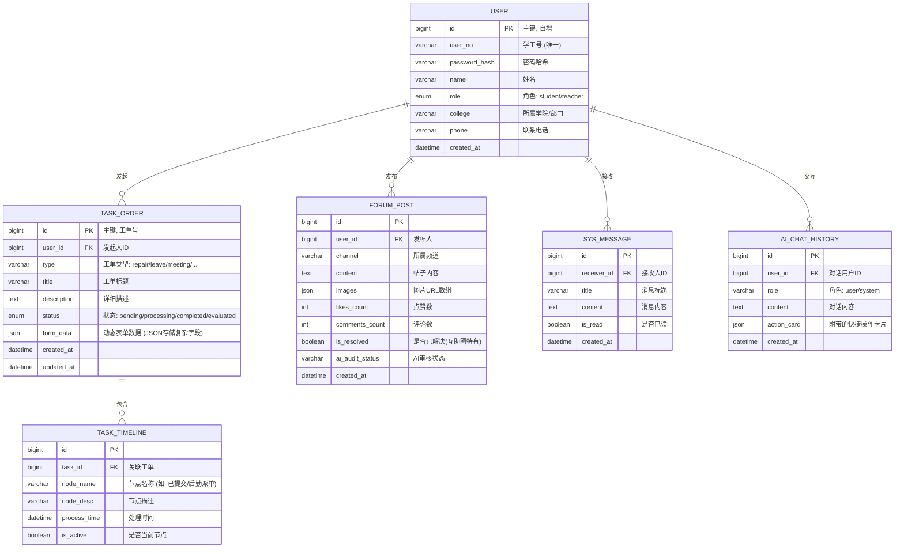

# 《校园百事通》后端系统设计文档 (Java Spring Boot)

本文档旨在为《校园百事通》项目的后端开发提供全景式指导，包括系统架构、数据库表结构设计（DDL与ER图）以及前端所需对接的 RESTful API 接口规范。

---

## 1. 数据库设计 (MySQL 8.0+)

### 1.1 实体关系图 (ER Diagram)



### 1.2 核心数据表定义 (DDL)

```sql
-- 1. 用户表
CREATE TABLE `sys_user` (
  `id` bigint(20) NOT NULL AUTO_INCREMENT,
  `user_no` varchar(32) NOT NULL COMMENT '学工号',
  `password_hash` varchar(128) NOT NULL COMMENT '密码(Bcrypt哈希)',
  `name` varchar(64) NOT NULL COMMENT '真实姓名',
  `role` varchar(16) NOT NULL COMMENT '角色: student/teacher/admin',
  `college` varchar(128) DEFAULT NULL COMMENT '所属学院/部门',
  `phone` varchar(16) DEFAULT NULL COMMENT '手机号',
  `created_at` datetime NOT NULL DEFAULT CURRENT_TIMESTAMP,
  PRIMARY KEY (`id`),
  UNIQUE KEY `uk_user_no` (`user_no`)
) ENGINE=InnoDB DEFAULT CHARSET=utf8mb4 COMMENT='用户基本信息表';

-- 2. 统一事项(工单)表
-- 设计亮点: 使用 JSON 字段 `form_data` 存储 14 种不同业务的差异化字段，实现业务解耦与高扩展性。
CREATE TABLE `biz_task_order` (
  `id` bigint(20) NOT NULL AUTO_INCREMENT COMMENT '系统流水号',
  `task_no` varchar(32) NOT NULL COMMENT '业务工单号(如: REP202310240001)',
  `user_id` bigint(20) NOT NULL COMMENT '发起人ID',
  `type` varchar(32) NOT NULL COMMENT '事项类型(repair/leave/meeting等)',
  `title` varchar(128) NOT NULL COMMENT '事项标题',
  `description` text COMMENT '详细说明',
  `status` varchar(16) NOT NULL DEFAULT 'pending' COMMENT '状态: pending/processing/completed/evaluated',
  `form_data` json NOT NULL COMMENT '动态表单JSON(存储地点、起止时间、图片URL等)',
  `material_score` int(11) DEFAULT '0' COMMENT 'AI评估的材料完整度(0-100)',
  `created_at` datetime NOT NULL DEFAULT CURRENT_TIMESTAMP,
  `updated_at` datetime NOT NULL DEFAULT CURRENT_TIMESTAMP ON UPDATE CURRENT_TIMESTAMP,
  PRIMARY KEY (`id`),
  UNIQUE KEY `uk_task_no` (`task_no`),
  KEY `idx_user_id` (`user_id`)
) ENGINE=InnoDB DEFAULT CHARSET=utf8mb4 COMMENT='统一事项工单表';

-- 3. 事项时间轴进度表
CREATE TABLE `biz_task_timeline` (
  `id` bigint(20) NOT NULL AUTO_INCREMENT,
  `task_id` bigint(20) NOT NULL COMMENT '关联工单ID',
  `node_name` varchar(64) NOT NULL COMMENT '节点名称',
  `node_desc` varchar(255) DEFAULT NULL COMMENT '处理意见/节点描述',
  `processor_name` varchar(64) DEFAULT NULL COMMENT '处理人姓名',
  `process_time` datetime DEFAULT NULL COMMENT '处理时间',
  `is_active` tinyint(1) NOT NULL DEFAULT '0' COMMENT '是否为当前所处节点',
  `created_at` datetime NOT NULL DEFAULT CURRENT_TIMESTAMP,
  PRIMARY KEY (`id`),
  KEY `idx_task_id` (`task_id`)
) ENGINE=InnoDB DEFAULT CHARSET=utf8mb4 COMMENT='工单处理时间轴';

-- 4. 百事圈(论坛)帖子表
CREATE TABLE `sns_forum_post` (
  `id` bigint(20) NOT NULL AUTO_INCREMENT,
  `user_id` bigint(20) NOT NULL COMMENT '发帖人ID',
  `channel` varchar(32) NOT NULL COMMENT '所属频道(互助/闲置/失物/活动墙等)',
  `content` text NOT NULL COMMENT '帖子正文',
  `images` json DEFAULT NULL COMMENT '图片URL数组',
  `likes_count` int(11) NOT NULL DEFAULT '0' COMMENT '点赞数',
  `comments_count` int(11) NOT NULL DEFAULT '0' COMMENT '评论数',
  `is_resolved` tinyint(1) NOT NULL DEFAULT '0' COMMENT '是否已解决(仅求助贴有效)',
  `ai_audit_status` varchar(16) NOT NULL DEFAULT 'passed' COMMENT 'AI审核状态: pending/passed/rejected',
  `created_at` datetime NOT NULL DEFAULT CURRENT_TIMESTAMP,
  PRIMARY KEY (`id`),
  KEY `idx_channel` (`channel`)
) ENGINE=InnoDB DEFAULT CHARSET=utf8mb4 COMMENT='百事圈社区帖子表';

-- 5. AI 对话历史表 (用于全局导办助手)
CREATE TABLE `ai_chat_history` (
  `id` bigint(20) NOT NULL AUTO_INCREMENT,
  `user_id` bigint(20) NOT NULL COMMENT '对话用户ID',
  `role` varchar(16) NOT NULL COMMENT '角色: user/system',
  `content` text NOT NULL COMMENT '对话内容',
  `action_card` json DEFAULT NULL COMMENT 'AI附带的快捷操作卡片信息',
  `created_at` datetime NOT NULL DEFAULT CURRENT_TIMESTAMP,
  PRIMARY KEY (`id`),
  KEY `idx_user_id` (`user_id`)
) ENGINE=InnoDB DEFAULT CHARSET=utf8mb4 COMMENT='AI智能体对话历史表';
```

---

## 2. API 接口文档规范

- **Base URL**: `https://api.campus.edu.cn/v1`
- **认证方式**: 所有受保护接口需在 Header 携带 `Authorization: Bearer <JWT_TOKEN>`
- **统一响应格式**:
  ```json
  {
    "code": 200,          // 业务状态码
    "message": "success", // 提示信息
    "data": {}            // 响应体
  }
  ```

### 2.1 认证模块 (Auth)

#### `POST /auth/login` - 统一身份认证登录
- **请求体 (Body)**:
  ```json
  {
    "account": "20230001",
    "password": "password123",
    "role": "student",
    "captchaType": "slider",
    "captchaToken": "xxx-xxx-xxx" // 滑块验证成功后的票据
  }
  ```
- **响应体 (Data)**:
  ```json
  {
    "token": "eyJhbGciOiJIUzI1NiIsIn...",
    "userInfo": {
      "id": "20230001",
      "name": "张同学",
      "role": "student"
    }
  }
  ```

### 2.2 统一事项(工单)模块 (Task)

#### `POST /tasks` - 发起新事项 (统一入口)
- **说明**: 前端 14 种服务大厅的表单提交均调用此接口。差异化的业务字段统一序列化放入 `formData` 中。
- **请求体 (Body)**:
  ```json
  {
    "type": "leave",
    "title": "病假申请(2天)",
    "description": "因发烧需要请假...",
    "materialScore": 80,
    "formData": {
      "leaveType": "病假",
      "start": "2023-10-24",
      "end": "2023-10-26",
      "leaveCampus": true,
      "destination": "江西省南昌市XX区",
      "imageUploaded": true
    }
  }
  ```

#### `GET /tasks` - 获取我的事项列表
- **请求参数 (Query)**:
  - `status`: `processing` | `completed` | `all`
  - `page`: `1`
  - `size`: `10`
- **响应体 (Data)**:
  ```json
  {
    "total": 42,
    "list": [
      {
        "id": "T1001",
        "taskNo": "LEA2023102401",
        "type": "leave",
        "title": "病假申请(2天)",
        "status": "pending",
        "createdAt": "2023-10-24 10:00:00"
      }
    ]
  }
  ```

#### `GET /tasks/{id}` - 获取事项详情与时间轴
- **响应体 (Data)**:
  ```json
  {
    "id": "T1001",
    "type": "leave",
    "title": "病假申请(2天)",
    "description": "...",
    "status": "processing",
    "formData": { /* 动态字段 */ },
    "timeline": [
      { "title": "提交申请", "desc": "系统已成功接收", "time": "2023-10-24 10:00", "active": true },
      { "title": "辅导员审批", "desc": "张老师审批中", "time": "", "active": false }
    ],
    "aiSummary": {
      "nextStep": "辅导员审批",
      "suggestAction": "如18:00前未审批可智能催办"
    }
  }
  ```

#### `POST /tasks/{id}/urge` - 智能催办
- **说明**: 触发该接口后，后端计算 SLA 是否超时，向当前节点的处理人发送催办通知（如企业微信/短信提醒）。

### 2.3 百事圈社区模块 (Forum)

#### `GET /forum/posts` - 获取帖子信息流
- **请求参数 (Query)**:
  - `channel`: 频道名称 (如 `校园互助`, `活动墙`)
- **响应体 (Data)**:
  ```json
  {
    "list": [
      {
        "id": 1,
        "authorName": "张同学",
        "avatar": "Felix",
        "content": "有同学捡到蓝色的天堂伞吗？",
        "images": ["url1"],
        "likes": 12,
        "comments": 5,
        "isResolved": false,
        "createdAt": "10分钟前"
      }
    ]
  }
  ```

#### `POST /forum/posts` - 发布帖子
- **说明**: 发布帖子时，后端需异步调用云端内容安全 API（文本反垃圾、图片鉴黄）进行合规性审查。

### 2.4 AI 智能导办模块 (Assistant)

#### `POST /ai/chat` - 发送对话消息
- **请求体 (Body)**:
  ```json
  {
    "message": "宿舍空调坏了怎么报修？"
  }
  ```
- **响应体 (Data)**:
  ```json
  {
    "reply": "网络故障让人头疼！您可以直接提交一个网络报修工单...",
    "actionCard": {
      "title": "发起后勤报修",
      "desc": "后勤中心快速响应",
      "path": "/pages/taskForm/index?type=repair&prefill=..."
    }
  }
  ```

### 2.5 全局搜索与文件上传 (Common)

#### `GET /search/global` - 全局搜索
- **请求参数 (Query)**:
  - `keyword`: 搜索关键字
- **响应体 (Data)**:
  - 返回匹配的 14 项服务快捷入口以及相关的历史工单和指南文档。

#### `POST /upload/image` - AI 智能图片上传与校验
- **说明**: 接收前端 `multipart/form-data` 上传的图片。后端可接入云端 AI 图像识别接口，校验图片清晰度或是否包含敏感内容。
- **响应体 (Data)**:
  ```json
  {
    "url": "https://oss.campus.edu.cn/images/xxx.jpg",
    "auditPassed": true,
    "suggestMsg": "校验通过"
  }
  ```