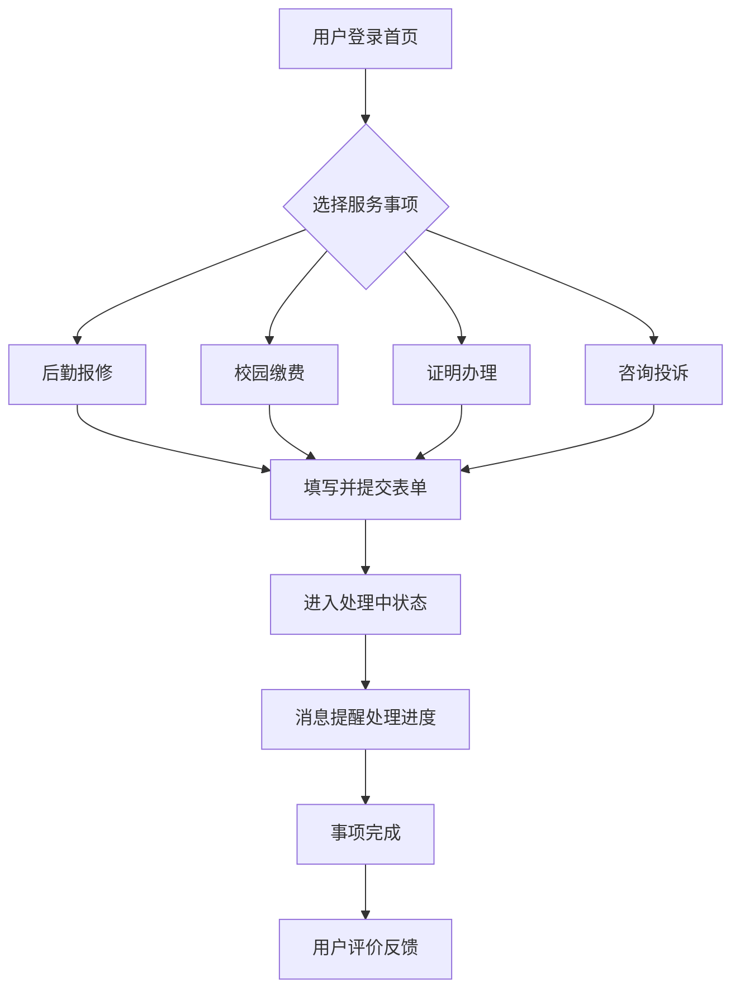

## 1. 产品概述
校园百事通是一款一站式校园民生服务平台 Demo，旨在解决校园内报修、缴费、办事等事项入口分散、流程不透明的问题。
- 主要目标是整合后勤报修、线上办事、意见反馈、校园缴费、证明办理、咨询问答等功能，为师生提供便捷的移动端体验，实现“办事少跑腿、沟通更顺畅”。

## 2. 核心功能

### 2.1 用户角色
| 角色 | 注册方式 | 核心权限 |
|------|----------|----------|
| 师生用户 | 校园统一身份认证登录 | 发起报修、办事、缴费、查询进度、接收提醒、评价反馈 |
| 管理员 | 后台配置账号 | 处理报修工单、回复咨询、管理系统信息（Demo中作为模拟角色） |

### 2.2 功能模块
1. **首页 (工作台)**：聚合所有服务入口（报修、办事、缴费、证明、咨询）、通知公告栏、快捷进度展示。
2. **服务办理页**：各类服务的具体填写表单（如报修表单、缴费确认单）。
3. **进度追踪页 (工单/办事列表)**：查看所有申请事项的当前状态、处理进度、历史记录。
4. **消息中心**：接收各类事项的进度变更提醒、系统通知。
5. **个人中心**：用户基础信息、我的评价、设置。

### 2.3 页面详情
| 页面名称 | 模块名称 | 功能描述 |
|----------|----------|----------|
| 首页 | 金刚区导航 | 提供后勤报修、校园缴费、证明办理、咨询投诉等快捷入口。 |
| 首页 | 通知跑马灯 | 展示最新校园公告及紧急通知。 |
| 首页 | 进度卡片 | 首页直观展示当前正在进行中的事项进度。 |
| 服务详情 | 表单填写 | 动态表单，支持文字、图片上传、位置选择（如报修地点）。 |
| 进度追踪 | 状态时间轴 | 以时间轴形式展示事项从提交、处理中到完成的全流程。 |
| 评价反馈 | 评价卡片 | 事项完成后，允许用户对服务质量进行星级打分和文字评价。 |

## 3. 核心流程
用户通过首页选择所需服务，填写表单并提交，系统生成工单。用户可在进度页查看处理状态，完成后进行评价。

## 4. 界面设计

### 4.1 设计风格
- **主次色调**：校园蓝（#1E3A8A）为主色调，象征专业与信任；辅助色为暖橙色（#F97316）和护眼绿（#10B981），用于状态提示。
- **按钮风格**：大圆角（rounded-2xl），柔和的轻拟物阴影，点击带有下压反馈。
- **字体及排版**：使用无衬线字体（如 Inter 或系统自带字体），字号清晰适中，增加行距以提升移动端阅读体验。
- **布局风格**：卡片式设计，适当的留白（Negative Space），底部固定导航栏（TabBar）。
- **图标风格**：双色线性图标或圆润面性图标，亲和力强。

### 4.2 页面设计概述
| 页面名称 | 模块名称 | UI 元素 |
|----------|----------|---------|
| 首页 | 顶部个人状态 | 渐变背景卡片，问候语，未读消息红点 |
| 首页 | 服务导航 | 2x3 或 3x3 均分网格图标卡片 |
| 进度页 | 时间轴卡片 | 垂直连线，状态点依据进度变色（灰-蓝-绿） |
| 表单页 | 输入控件 | 浮动标签输入框，底部固定悬浮提交按钮 |

### 4.3 响应式
项目采用**移动端优先（Mobile-first）**设计，在 PC 端以居中的手机模拟器形态呈现（最大宽度约束），确保在不同设备上均能提供类小程序的沉浸式体验。
