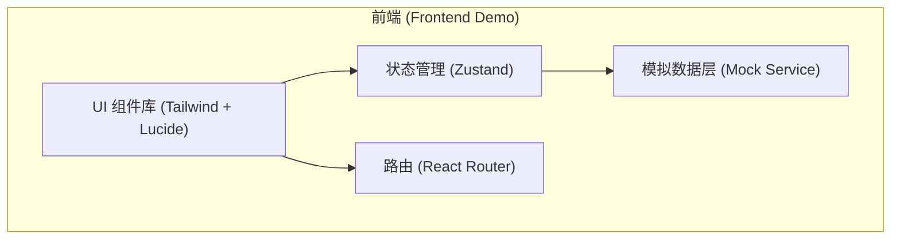
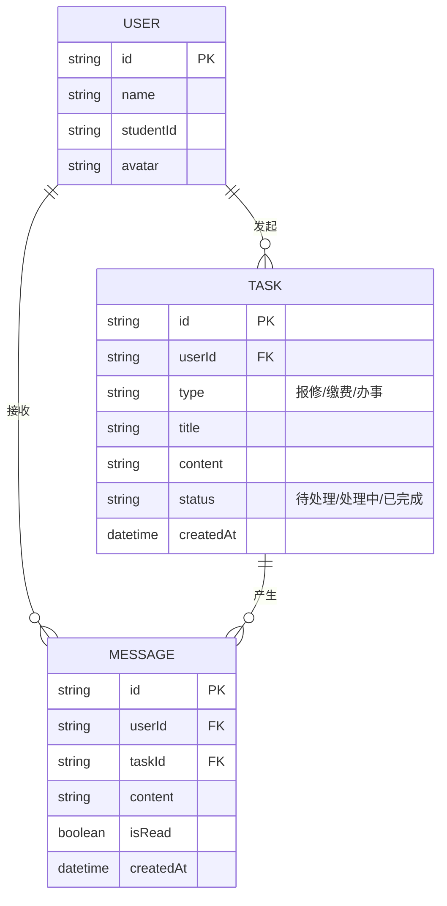

## 1. 架构设计



## 2. 技术说明
- **前端框架**: React 18 + Vite
- **样式方案**: Tailwind CSS 3 (原子化 CSS) + framer-motion (页面切换与微交互动画)
- **图标库**: lucide-react
- **状态管理**: Zustand (用于跨页面共享工单状态、通知数量)
- **路由管理**: React Router DOM (Web Hash/Browser Router)
- **环境说明**: 这是一个纯前端 Demo，数据交互通过内存对象或 LocalStorage 模拟，不依赖外部后端服务，以便快速展示功能流程。

## 3. 路由定义
| 路由路径 | 用途 |
|----------|------|
| `/` | 引导页/登录模拟 |
| `/home` | 首页（金刚区、快捷通知） |
| `/services/:id` | 服务办理页（后勤报修、缴费等通用或独立表单） |
| `/progress` | 进度追踪列表页 |
| `/progress/:id` | 事项进度详情与评价页 |
| `/messages` | 消息通知中心 |
| `/profile` | 个人中心 |

## 4. API 定义 (Mock 接口)
由于是纯前端 Demo，我们定义了以下 TypeScript 类型和 Mock 业务逻辑层：

```typescript
// 统一响应结构
interface ApiResponse<T> {
  code: number;
  message: string;
  data: T;
}

// 工单/事项状态
type TaskStatus = 'pending' | 'processing' | 'completed' | 'evaluated';

interface ServiceTask {
  id: string;
  type: 'repair' | 'payment' | 'proof' | 'consult';
  title: string;
  description: string;
  status: TaskStatus;
  createdAt: string;
  updatedAt: string;
}

// 模拟 API 接口
interface MockApi {
  getTasks(): Promise<ApiResponse<ServiceTask[]>>;
  createTask(data: Partial<ServiceTask>): Promise<ApiResponse<ServiceTask>>;
  updateTaskStatus(id: string, status: TaskStatus): Promise<ApiResponse<void>>;
}
```

## 5. 服务架构图
(本项目为纯前端 Demo 演示，无真实后端依赖)

## 6. 数据模型
### 6.1 数据模型定义



### 6.2 数据定义说明
前端将使用 `localStorage` 或内存中 `Zustand` store 持久化 `USER`, `TASK`, `MESSAGE` 三类核心数据模型，以确保在 Demo 体验过程中刷新不丢失状态。